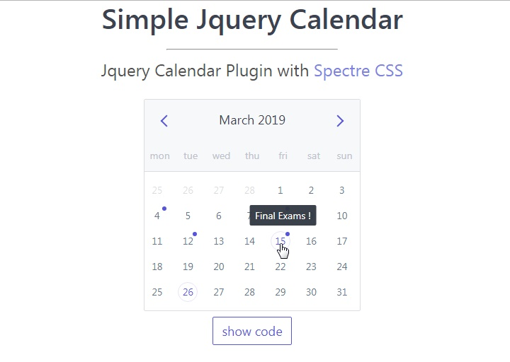

# Simple Jquery Calendar with Spectre-CSS

A simple JQuery calendar made using [**simple calendar by brospars**](https://github.com/brospars/simple-calendar) and the awesome [**Spectre CSS framework**](https://github.com/picturepan2/spectre)

[](https://monsterbrain.github.io/simple-calendar-with-jquery-spectre-css/)

## [Checkout the Demo](https://monsterbrain.github.io/simple-calendar-with-jquery-spectre-css/)

## Basic usage

Requires
- JQuery
- Spectre CSS

add style headers.
```
<link rel="stylesheet" href="lib/spectre.css">
<link rel="stylesheet" href="lib/spectre-exp.css">
<link rel="stylesheet" href="lib/spectre-icons.css">
```
include the scripts
```
<script src="jquery-2.1.4.min.js"></script>
<script src="jquery.simple-calendar.js"></script>
```

Basic usage script with events
```
$("#container").simpleCalendar({
    fixedStartDay: false,
    events: ['2019-03-04', '2019-03-08', '2019-03-12', '2019-03-15'],
    eventsInfo: ['John\'s Birthday', 'Janet\'s Marriage','Graduation Day', 'Final Exams !'],
    selectCallback: function(date){
        console.log('date selected '+date);
    }
});
```

*Let me know if you run into any issues. Hope it helps you.*
